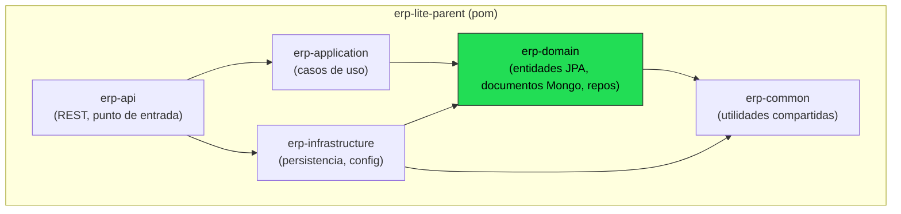
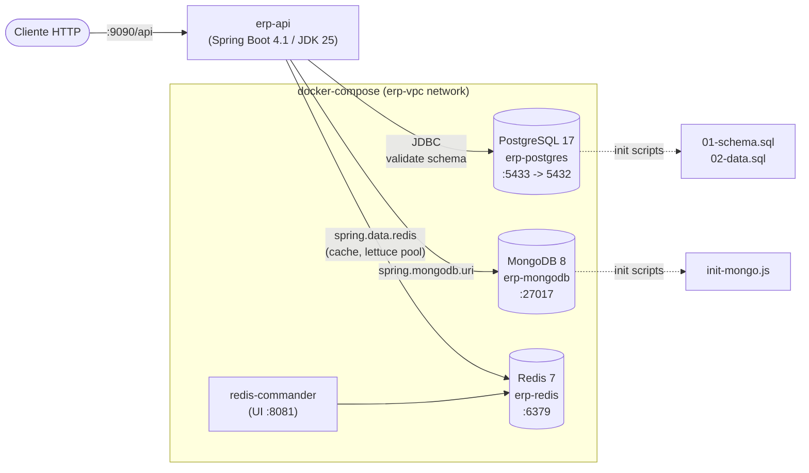
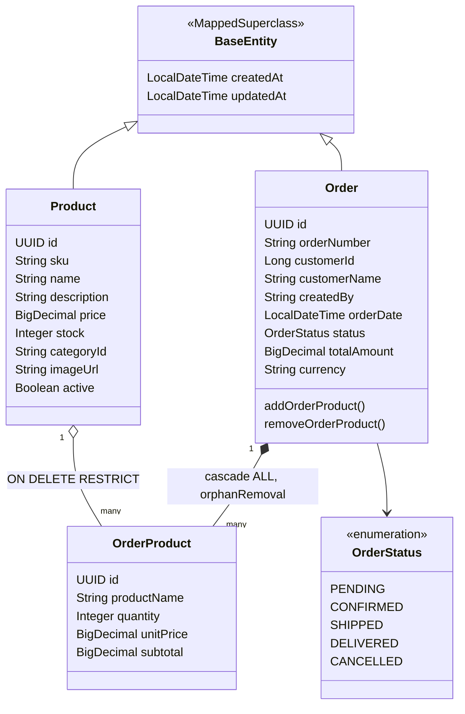
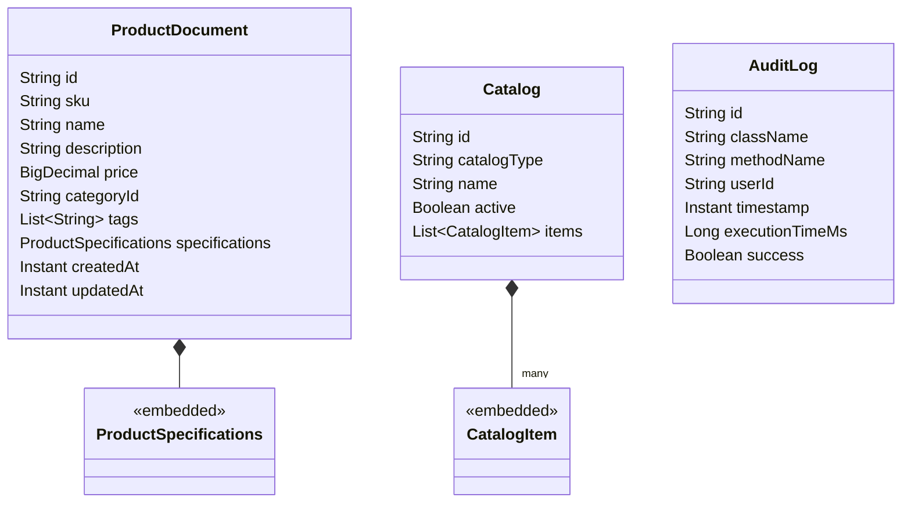

# Arquitectura del proyecto — ERP Lite

Diagrama del estado actual del proyecto: módulos Maven, dependencias entre capas,
infraestructura (Docker) y modelo de dominio (JPA + Spring Data MongoDB).

## 1. Módulos Maven y dependencias entre capas

Arquitectura modular por capas (estilo Clean/Hexagonal): `erp-api` es el único punto de
entrada HTTP, `erp-domain` no depende de ningún otro módulo propio y `erp-common` es
compartido transversalmente.

- **erp-api**: `ErpApiApplication`, `HealthController`. Expone el servlet en `/api` (puerto `9090`).
- **erp-application**: `ApplicationService` (aún placeholder, capa de casos de uso).
- **erp-domain**: entidades JPA (`entity`), documentos Mongo (`document`), interfaces de
  repositorio (`repository`). No tiene dependencias a `erp-application` ni `erp-infrastructure`.
- **erp-infrastructure**: `MongoConfig` (`@EnableMongoAuditing`), `BaseRepository` (placeholder).
  Aporta los starters de Postgres/Mongo/Redis a los módulos que dependen de él.
- **erp-common**: utilidades genéricas (`CommonUtil`).

## 2. Infraestructura y despliegue (docker-compose)

- Postgres: datos transaccionales (`orders`, `order_products`, `products`).
- MongoDB: catálogos, documentos flexibles y auditoría (`product_documents`, `catalogs`, `audit_logs`).
- Redis: cache (pool Lettuce configurado, `commons-pool2` en `erp-infrastructure`).

## 3. Modelo de dominio

### 3.1 Entidades JPA (PostgreSQL)

Repositorios: `ProductRepository`, `OrderRepository`, `OrderProductRepository`
(`JpaRepository<T, UUID>`).

### 3.2 Documentos MongoDB

Repositorios: `ProductDocumentRepository`, `CatalogRepository`, `AuditLogRepository`
(`MongoRepository`).

## Notas del estado actual

- `erp-application` (`ApplicationService`) e `erp-infrastructure` (`BaseRepository`) son
  todavía placeholders sin lógica real — la capa de casos de uso aún no está implementada.
- El módulo `erp-api` sólo expone `HealthController`; no hay controladores de negocio (productos,
  órdenes) todavía.
- Relación entre Postgres y Mongo es lógica, no por FK: `Product.categoryId` referencia un
  documento de catálogo en MongoDB (`erp_catalog_db`), no una tabla relacional.
