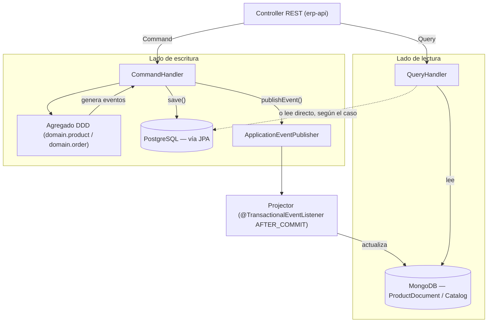

# Diseño CQRS — ERP Lite (rama `07/cqrs-commands`)

> **Estado: solo diseño.** Nada de este documento está implementado todavía — es la base para
> cuando se decida implementar. No modifica código existente.

Este documento propone cómo aplicar **CQRS** (*Command Query Responsibility Segregation*)
sobre la estructura que ya existe en el proyecto, en vez de inventar una arquitectura nueva
desde cero.

---

## 0. Por qué este proyecto ya está a mitad de camino

Antes de diseñar nada nuevo, vale la pena notar lo que **ya existe** y encaja directamente
en un esquema CQRS (ver [`ddd-domain-model.md`](ddd-domain-model.md) y
[`arquitectura-proyecto.md`](arquitectura-proyecto.md)):

| Ya existe | Para qué serviría en CQRS |
|---|---|
| Agregado `domain.product.Product` con `create/update/incrementStock/decrementStock/changePrice/deactivate` | Modelo de **escritura** (lado Command) |
| Eventos `ProductCreated`, `ProductUpdated`, `StockChanged`, `ProductDeactivated` (`domain.product.events`) | Señal para **proyectar** el cambio al modelo de lectura |
| Agregado `domain.order.Order` + eventos `OrderCreated/Confirmed/Shipped/Delivered/Cancelled` | Ídem para órdenes |
| `ProductDocument` + `ProductDocumentRepository` (MongoDB) | Modelo de **lectura** de catálogo (ya modelado, ya indexado con `@TextIndexed`, aún sin usar) |
| `Catalog`/`CatalogItem` (MongoDB) | Vista de lectura agregada (ej. "catálogo por categoría") |
| `AuditLog`/`AuditLogRepository` (MongoDB) | Auditoría de comandos — tiene `className`, `methodName`, `executionTimeMs`, `success`, justo lo que se necesita para loguear ejecuciones de comandos |
| Comentario en `docker-compose.yml`: *"MongoDB - Document database (Catalogs, AuditLogs, **Product Queries**)"* | Confirma que el plan original ya separaba Postgres (escritura) de Mongo (lectura) |

**Lo que falta:** nadie llama a los agregados DDD todavía (los casos de uso actuales —
`UploadProductImageService`, `DeleteProductService`, `SendOrderConfirmationEmailService` —
manipulan directamente las *entidades JPA* en `domain.entity`, no los agregados de
`domain.product`/`domain.order`), los eventos nunca se publican (`AggregateRoot` solo los
acumula en una lista), y nada escribe en `ProductDocument`/`Catalog`. Ese es exactamente el
hueco que este diseño llena.

---

## 1. Idea central

- **Command** = una intención de **cambiar** estado (`CreateProductCommand`,
  `IncrementStockCommand`, `ConfirmOrderCommand`). Se valida contra las reglas del agregado
  DDD y no debería devolver datos de negocio — como mucho, el id de lo creado/modificado.
- **Query** = una petición de **leer** datos. Nunca toca un agregado ni dispara eventos; lee
  directo del repositorio (JPA o Mongo) y devuelve un DTO plano de solo lectura (`XxxView`).

Las dos rutas dejan de compartir el mismo servicio — hoy `UploadProductImageService` mezcla
"guardar el producto" (escritura) con "generar la URL prefirmada y devolverla" (lectura de
S3); con CQRS eso se separaría en un Command (guarda la imagen) y una Query aparte (si se
necesita la URL después).

---

## 2. Estructura de paquetes propuesta

Todo dentro de `erp-application`, sin tocar `erp-domain` ni `erp-infrastructure` más que para
las piezas de sincronización (sección 5):

```
erp-application/src/main/java/com/SpringBoot/application/
├── command/
│   ├── Command.java                     (marker interface, vacío)
│   ├── CommandHandler.java              (interfaz genérica)
│   ├── product/
│   │   ├── CreateProductCommand.java
│   │   ├── CreateProductCommandHandler.java
│   │   ├── IncrementProductStockCommand.java
│   │   ├── IncrementProductStockCommandHandler.java
│   │   └── ...
│   └── order/
│       ├── ConfirmOrderCommand.java
│       ├── ConfirmOrderCommandHandler.java
│       └── ...
│
├── query/
│   ├── Query.java                       (marker interface, vacío)
│   ├── QueryHandler.java                (interfaz genérica)
│   ├── product/
│   │   ├── GetProductBySkuQuery.java
│   │   ├── GetProductBySkuQueryHandler.java
│   │   ├── SearchProductsQuery.java
│   │   ├── SearchProductsQueryHandler.java
│   │   └── view/
│   │       └── ProductView.java         (record, plano — lo que consume el front)
│   └── order/
│       ├── GetOrderByIdQuery.java
│       ├── GetOrderByIdQueryHandler.java
│       └── view/
│           └── OrderView.java
│
├── port/outbound/                        (SIN CAMBIOS: StoragePort, MailPort, MailException...)
└── usecase/                               (existentes: se migran gradualmente, ver sección 7)
```

`erp-domain/customer/CustomerProvider` (puerto de integración externa) tampoco cambia — no es
ni Command ni Query, es un puerto de infraestructura que ya usan tanto comandos como queries
cuando necesiten datos de cliente.

---

## 3. Contratos base

```java
package com.SpringBoot.application.command;

public interface Command {
}
```

```java
package com.SpringBoot.application.command;

public interface CommandHandler<C extends Command, R> {
    R handle(C command);
}
```

```java
package com.SpringBoot.application.query;

public interface Query {
}
```

```java
package com.SpringBoot.application.query;

public interface QueryHandler<Q extends Query, R> {
    R handle(Q query);
}
```

Los marker interfaces (`Command`/`Query`) están vacíos a propósito — no fuerzan ningún
método, solo permiten identificar el tipo para logging/auditoría transversal (ver sección 6).
Cada handler es un `@Service` normal, igual que los `usecase/` actuales — no hace falta un bus
de comandos (Axon/Mediator) para un proyecto de este tamaño; sería una abstracción sin
beneficio real todavía.

---

## 4. Lado de escritura (Command) — usando los agregados DDD

Ejemplo concreto: subir stock de un producto.

```java
package com.SpringBoot.application.command.product;

public record IncrementProductStockCommand(UUID productId, int quantity, String reason) implements Command {
}
```

```java
package com.SpringBoot.application.command.product;

@Service
public class IncrementProductStockCommandHandler implements CommandHandler<IncrementProductStockCommand, Void> {

    private final ProductRepository productRepository;       // JPA, ya existe
    private final ApplicationEventPublisher eventPublisher;   // Spring, no requiere nada nuevo

    @Override
    @Transactional
    public Void handle(IncrementProductStockCommand command) {
        // 1. Cargar el agregado DDD a partir de la entidad JPA persistida
        Product aggregate = ProductMapper.toAggregate(
                productRepository.findById(command.productId())
                        .orElseThrow(() -> new ProductNotFoundException(command.productId())));

        // 2. La regla de negocio vive en el agregado, no en el handler
        aggregate.incrementStock(command.quantity(), command.reason());

        // 3. Persistir el nuevo estado (mapear agregado -> entidad JPA)
        productRepository.save(ProductMapper.toEntity(aggregate));

        // 4. Publicar los eventos que el agregado acumuló y limpiarlos
        aggregate.getDomainEvents().forEach(eventPublisher::publishEvent);
        aggregate.clearDomainEvents();

        return null;
    }
}
```

**Nota honesta:** hoy no existe `ProductMapper` (agregado ↔ entidad JPA) — hay que escribirlo.
Es la única pieza nueva de infraestructura que este diseño exige para el lado de escritura;
todo lo demás (repositorio, agregado, eventos) ya está.

Si se prefiere no adoptar los agregados DDD todavía (para ir más rápido), la alternativa es
que el `CommandHandler` manipule la entidad JPA directamente —igual que hacen
`UploadProductImageService`/`DeleteProductService` hoy— y publique un evento "a mano"
(`new StockChanged(...)`) sin pasar por `Product.incrementStock()`. Es válido como paso
intermedio, pero pierde la ventaja de que la regla de negocio (validar cantidad, motivo, etc.)
esté centralizada en el agregado.

---

## 5. Lado de lectura (Query) — sin agregados, sin eventos

Las queries **no** tocan `domain.product.Product` ni `domain.order.Order` — leen directo del
repositorio que más convenga y devuelven un `View` plano.

```java
package com.SpringBoot.application.query.product;

public record GetProductBySkuQuery(String sku) implements Query {
}
```

```java
package com.SpringBoot.application.query.product.view;

public record ProductView(
        String sku, String name, BigDecimal price, Integer stock,
        String categoryName, boolean active
) {
}
```

```java
package com.SpringBoot.application.query.product;

@Service
public class GetProductBySkuQueryHandler implements QueryHandler<GetProductBySkuQuery, ProductView> {

    private final ProductDocumentRepository productDocumentRepository; // Mongo, ya existe

    @Override
    public ProductView handle(GetProductBySkuQuery query) {
        ProductDocument doc = productDocumentRepository.findBySku(query.sku())
                .orElseThrow(() -> new ProductNotFoundException(query.sku()));

        return new ProductView(doc.getSku(), doc.getName(), doc.getPrice(), doc.getStock(),
                doc.getCategoryName(), doc.getActive());
    }
}
```

Ojo: la query lee de **Mongo** (`ProductDocument`), no de Postgres. Es la esencia de CQRS con
persistencia poliglota: el lado de lectura no compite por bloqueos con el lado transaccional,
y puede tener una forma completamente distinta (con `tags`, `specifications`,
`@TextIndexed` para búsqueda) sin ensuciar el modelo de escritura.

Para queries que no necesiten esa flexibilidad (ej. "traer una orden por id" para el propio
flujo interno), leer directo de Postgres vía `OrderRepository` es perfectamente válido — no
todas las queries necesitan pasar por Mongo.

---

## 6. Sincronización lectura-escritura (el "Projector")

Sin esta pieza, `ProductDocument` en Mongo nunca se actualiza y las queries devuelven datos
viejos. Un listener en `erp-infrastructure` reacciona a los eventos publicados en el paso 4
de la sección 4:

```java
package com.SpringBoot.infrastructure.projection;

@Component
public class ProductProjection {

    private final ProductDocumentRepository productDocumentRepository;

    @TransactionalEventListener(phase = TransactionPhase.AFTER_COMMIT)
    public void on(StockChanged event) {
        productDocumentRepository.findById(event.productId().value().toString())
                .ifPresent(doc -> {
                    doc.setStock(event.newStock());
                    productDocumentRepository.save(doc);
                });
    }

    @TransactionalEventListener(phase = TransactionPhase.AFTER_COMMIT)
    public void on(ProductCreated event) {
        // mapear ProductCreated -> nuevo ProductDocument y guardarlo
    }

    // ProductUpdated, ProductDeactivated: mismo patrón
}
```

`AFTER_COMMIT` es importante: si la transacción de Postgres falla y hace rollback, el
proyector no debe tocar Mongo — evita que el catálogo de lectura quede inconsistente con
datos que nunca se confirmaron.

Este mismo mecanismo es el lugar natural para alimentar `AuditLog`: un listener genérico que
escuche *todos* los eventos de dominio (o se dispare alrededor de cada `CommandHandler` vía
un `@Around` de AOP) y escriba un `AuditLog` por cada comando ejecutado, usando exactamente
los campos que ya tiene esa clase (`className`, `methodName`, `executionTimeMs`, `success`).

---

## 7. Qué pasa con los `usecase/` actuales

No hace falta migrarlos todos de golpe. Sugerencia de equivalencia, para cuando se decida
implementar:

| Actual (`usecase/`) | Se convierte en |
|---|---|
| `UploadProductImageService.upload(...)` | `UploadProductImageCommand` + su handler (sigue usando `StoragePort`, sin cambios ahí) |
| `DeleteProductService.delete(...)` | `DeleteProductCommand` + su handler |
| `SendOrderConfirmationEmailService.sendConfirmation(...)` | Este ya es, en esencia, un Command sin retorno — solo renombrarlo/moverlo a `command/order/SendOrderConfirmationCommand` cuando se toque esa parte. No usa agregados (no necesita cambiar su lógica interna). |

Los `port/outbound/*` (`StoragePort`, `MailPort`, `MailException`, `OrderConfirmationEmail`)
**no se tocan** — son puertos de infraestructura externa, ortogonales a si el caller es un
Command o un usecase clásico.

---

## 8. Convención de nombres

| Elemento | Patrón | Ejemplo |
|---|---|---|
| Comando | `<Verbo><Entidad>Command` | `IncrementProductStockCommand` |
| Handler de comando | `<NombreComando>Handler` | `IncrementProductStockCommandHandler` |
| Query | `Get<Entidad>By<Criterio>Query` / `Search<Entidad>Query` | `GetProductBySkuQuery` |
| Handler de query | `<NombreQuery>Handler` | `GetProductBySkuQueryHandler` |
| DTO de lectura | `<Entidad>View` | `ProductView`, `OrderView` |
| Projector | `<Entidad>Projection` | `ProductProjection` |

---

## 9. Diagrama del flujo completo



---

## 10. Plan de migración sugerido (para cuando se implemente)

1. Crear `Command`, `CommandHandler`, `Query`, `QueryHandler` (paso 3) — no rompe nada existente.
2. Elegir **un** caso de uso ya existente y sencillo para migrar primero (candidato:
   `DeleteProductService`, porque no requiere el `ProductMapper` agregado↔JPA — es solo
   borrar).
3. Escribir `ProductMapper` (agregado DDD ↔ entidad JPA) — necesario para cualquier Command
   que sí use el agregado (`incrementStock`, `changePrice`, etc.).
4. Implementar `ProductProjection` y probar que `ProductDocument` se actualiza correctamente
   tras un Command.
5. Recién ahí escribir la primera Query real (`GetProductBySkuQueryHandler`) contra
   `ProductDocument`, y exponerla en un controller REST nuevo.
6. Repetir el patrón para `Order` cuando haga falta (ya tiene agregado + eventos listos).

No es necesario migrar `SendOrderConfirmationEmailService` en este proceso — puede quedarse
como está indefinidamente; CQRS no es obligatorio para *todo* el módulo, solo donde el
proyecto ya tiene la infraestructura de lectura/escritura separada (Product, y luego Order).

---

## 11. Estado real de implementación (Product)

Ya implementados en `erp-application/command/product/`: `ProductMapper` (con el método
`Product.reconstitute(...)` agregado en `erp-domain` para poder cargar un agregado existente
sin disparar `ProductCreated`) y los 7 comandos/handlers que cubren el 100% de los métodos
públicos del agregado: `CreateProductCommand`, `UpdateProductCommand`,
`IncrementProductStockCommand`, `DecrementProductStockCommand`, `ChangeProductPriceCommand`,
`ActivateProductCommand`, `DeactivateProductCommand`. También se agregó
`DuplicateSkuException` (`erp-domain/entity`), verificado en `CreateProductCommandHandler`
antes de crear.

Pendiente: tests de los comandos, el `ProductProjection` (sección 6) y las Queries (sección 5)
— quedaron fuera de este alcance a propósito.

### Decisión pendiente: ¿se puede operar sobre un producto desactivado?

Hoy **ningún** handler valida `aggregate.isActive()` antes de ejecutar. Es decir,
`IncrementProductStockCommand`, `DecrementProductStockCommand`, `ChangeProductPriceCommand` y
`UpdateProductCommand` funcionan igual sobre un producto activo o desactivado — no hay ninguna
regla que lo impida.

Es una decisión de negocio, no técnica, por eso quedó sin resolver a propósito: ¿tiene sentido
permitir subir stock o cambiar precio de un producto que ya se desactivó? Si la respuesta es
"no", la implementación sería:

1. Agregar `ProductInactiveException` (mismo patrón que `ProductNotFoundException`,
   `DuplicateSkuException`) en `erp-domain/entity`.
2. Al inicio de `IncrementProductStockCommandHandler`, `DecrementProductStockCommandHandler`,
   `ChangeProductPriceCommandHandler` y `UpdateProductCommandHandler`, después de mapear a
   agregado: `if (!aggregate.isActive()) throw new ProductInactiveException(...)`.

No se implementó porque falta decidir la regla — cuando se defina, es un cambio pequeño y
localizado en esos 4 handlers.

---

## 12. Pendientes de nivel bajo (documentados, no implementados)

Tras resolver los de nivel Alto (`@Version`, liberación de stock al cancelar) y Medio
(listeners de eventos, tests, controllers), quedan estos 3, deliberadamente sin tocar:

### 12.1 Carrera (TOCTOU) en `DuplicateSkuException`

`CreateProductCommandHandler` valida `productRepository.existsBySku(sku)` y luego hace
`save(...)` — no son atómicos. Bajo concurrencia exacta (dos requests con el mismo SKU al
mismo tiempo), ambos podrían pasar la validación y uno terminaría fallando con un
`DataIntegrityViolationException` crudo de Hibernate (por el `@UniqueConstraint` en la
columna `sku`) en vez de `DuplicateSkuException`. La constraint de la base de datos ya evita
la corrupción real de datos — lo único que cambiaría es qué excepción ve el usuario.

**Cómo resolverlo cuando se decida:** envolver el `save(...)` en un `try/catch` sobre
`DataIntegrityViolationException` y relanzar como `DuplicateSkuException`, igual patrón que ya
usa `DeleteProductService` con `ProductInUseException`.

### 12.2 Regla "producto inactivo"

Ver sección 11 — ningún handler valida `aggregate.isActive()` antes de mutar. Es una decisión
de negocio pendiente (¿se puede subir stock o cambiar precio de un producto desactivado?), no
una falla técnica. Solución ya esbozada ahí: `ProductInactiveException` + un check al inicio de
`IncrementProductStockCommandHandler`, `DecrementProductStockCommandHandler`,
`ChangeProductPriceCommandHandler` y `UpdateProductCommandHandler`.

### 12.3 Dos modelos a sincronizar a mano (agregado DDD ↔ entidad JPA)

No es un defecto puntual sino un costo de mantenimiento inherente al diseño elegido: cada
campo nuevo que se agregue a `Product`/`Order` (agregado) o a sus entidades JPA hay que
recordar agregarlo también en `ProductMapper`/`OrderMapper`, o el mapeo queda incompleto en
silencio (el compilador no avisa). Mitigación posible a futuro: un test que, por reflexión,
compare los campos del agregado contra los que el mapper efectivamente lee/escribe — no se
implementó por ser una inversión mayor para un problema que hoy no ha causado ningún bug real
(a diferencia del bug de `imageUrl` que sí se encontró y arregló en la sección de mappers).
