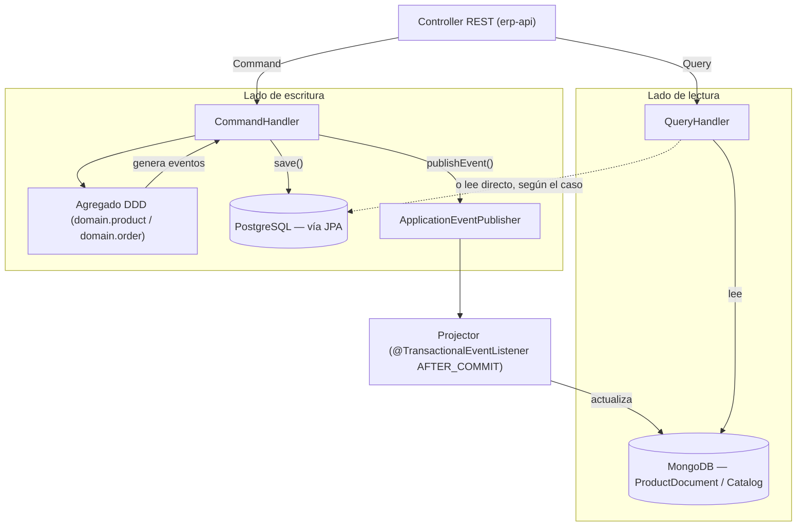

# Diseño CQRS — ERP Lite

> **Estado: implementado.** Las secciones 1–9 describen el diseño original y siguen
> describiendo fielmente cómo quedó construido. Las secciones 10 en adelante documentan el
> estado real — Product, Order, Category y Audit ya siguen este patrón de punta a punta
> (comandos, queries, paginación, caché con invalidación, y auditoría vía AOP). Ver la sección
> 13 para el resumen completo de lo implementado más allá del alcance original de este
> documento.

Este documento propone cómo aplicar **CQRS** (*Command Query Responsibility Segregation*)
sobre la estructura que ya existe en el proyecto, en vez de inventar una arquitectura nueva
desde cero.

---

## 0. Por qué este proyecto ya está a mitad de camino

Antes de diseñar nada nuevo, vale la pena notar lo que **ya existe** y encaja directamente
en un esquema CQRS (ver [`ddd-domain-model.md`](ddd-domain-model.md) y
[`arquitectura-proyecto.md`](arquitectura-proyecto.md)):

| Ya existe | Para qué serviría en CQRS |
|---|---|
| Agregado `domain.product.Product` con `create/update/incrementStock/decrementStock/changePrice/deactivate` | Modelo de **escritura** (lado Command) |
| Eventos `ProductCreated`, `ProductUpdated`, `StockChanged`, `ProductDeactivated` (`domain.product.events`) | Señal para **proyectar** el cambio al modelo de lectura |
| Agregado `domain.order.Order` + eventos `OrderCreated/Confirmed/Shipped/Delivered/Cancelled` | Ídem para órdenes |
| `ProductDocument` + `ProductDocumentRepository` (MongoDB) | Modelo de **lectura** de catálogo (ya modelado, ya indexado con `@TextIndexed`, aún sin usar) |
| `Catalog`/`CatalogItem` (MongoDB) | Vista de lectura agregada (ej. "catálogo por categoría") |
| `AuditLog`/`AuditLogRepository` (MongoDB) | Auditoría de comandos — tiene `className`, `methodName`, `executionTimeMs`, `success`, justo lo que se necesita para loguear ejecuciones de comandos |
| Comentario en `docker-compose.yml`: *"MongoDB - Document database (Catalogs, AuditLogs, **Product Queries**)"* | Confirma que el plan original ya separaba Postgres (escritura) de Mongo (lectura) |

**Estado actual (ya no es un hueco):** los tres casos de uso que manipulaban las entidades JPA
directamente se migraron al patrón `CommandHandler` — `DeleteProductCommand`,
`UploadProductImageCommand` y `SendOrderConfirmationCommand` (antes `usecase/DeleteProductService`,
`UploadProductImageService`, `SendOrderConfirmationEmailService`; el paquete `usecase/` quedó
vacío). Los agregados DDD se usan en todos los handlers de escritura de Product/Order, los
eventos se publican vía `ApplicationEventPublisher`, y `ProductProjection` los consume para
mantener `ProductDocument` sincronizado. Ver sección 13 para el detalle completo.

---

## 1. Idea central

- **Command** = una intención de **cambiar** estado (`CreateProductCommand`,
  `IncrementStockCommand`, `ConfirmOrderCommand`). Se valida contra las reglas del agregado
  DDD y no debería devolver datos de negocio — como mucho, el id de lo creado/modificado.
- **Query** = una petición de **leer** datos. Nunca toca un agregado ni dispara eventos; lee
  directo del repositorio (JPA o Mongo) y devuelve un DTO plano de solo lectura (`XxxView`).

Las dos rutas dejan de compartir el mismo servicio — hoy `UploadProductImageService` mezcla
"guardar el producto" (escritura) con "generar la URL prefirmada y devolverla" (lectura de
S3); con CQRS eso se separaría en un Command (guarda la imagen) y una Query aparte (si se
necesita la URL después).

---

## 2. Estructura de paquetes propuesta

Todo dentro de `erp-application`, sin tocar `erp-domain` ni `erp-infrastructure` más que para
las piezas de sincronización (sección 5):

```
erp-application/src/main/java/com/SpringBoot/application/
├── command/
│   ├── Command.java                     (marker interface, vacío)
│   ├── CommandHandler.java              (interfaz genérica)
│   ├── product/
│   │   ├── CreateProductCommand.java
│   │   ├── CreateProductCommandHandler.java
│   │   ├── IncrementProductStockCommand.java
│   │   ├── IncrementProductStockCommandHandler.java
│   │   └── ...
│   └── order/
│       ├── ConfirmOrderCommand.java
│       ├── ConfirmOrderCommandHandler.java
│       └── ...
│
├── query/
│   ├── Query.java                       (marker interface, vacío)
│   ├── QueryHandler.java                (interfaz genérica)
│   ├── product/
│   │   ├── GetProductBySkuQuery.java
│   │   ├── GetProductBySkuQueryHandler.java
│   │   ├── SearchProductsQuery.java
│   │   ├── SearchProductsQueryHandler.java
│   │   └── view/
│   │       └── ProductView.java         (record, plano — lo que consume el front)
│   └── order/
│       ├── GetOrderByIdQuery.java
│       ├── GetOrderByIdQueryHandler.java
│       └── view/
│           └── OrderView.java
│
└── port/outbound/                        (SIN CAMBIOS: StoragePort, MailPort, MailException...)
```

(`usecase/` ya no existe — los tres casos que había se migraron a `command/`, ver sección 7)

`erp-domain/customer/CustomerProvider` (puerto de integración externa) tampoco cambia — no es
ni Command ni Query, es un puerto de infraestructura que ya usan tanto comandos como queries
cuando necesiten datos de cliente.

---

## 3. Contratos base

```java
package com.SpringBoot.application.command;

public interface Command {
}
```

```java
package com.SpringBoot.application.command;

public interface CommandHandler<C extends Command, R> {
    R handle(C command);
}
```

```java
package com.SpringBoot.application.query;

public interface Query {
}
```

```java
package com.SpringBoot.application.query;

public interface QueryHandler<Q extends Query, R> {
    R handle(Q query);
}
```

Los marker interfaces (`Command`/`Query`) están vacíos a propósito — no fuerzan ningún
método, solo permiten identificar el tipo para logging/auditoría transversal (ver sección 6).
Cada handler es un `@Service` normal, igual que los `usecase/` actuales — no hace falta un bus
de comandos (Axon/Mediator) para un proyecto de este tamaño; sería una abstracción sin
beneficio real todavía.

---

## 4. Lado de escritura (Command) — usando los agregados DDD

Ejemplo concreto: subir stock de un producto.

```java
package com.SpringBoot.application.command.product;

public record IncrementProductStockCommand(UUID productId, int quantity, String reason) implements Command {
}
```

```java
package com.SpringBoot.application.command.product;

@Service
public class IncrementProductStockCommandHandler implements CommandHandler<IncrementProductStockCommand, Void> {

    private final ProductRepository productRepository;       // JPA, ya existe
    private final ApplicationEventPublisher eventPublisher;   // Spring, no requiere nada nuevo

    @Override
    @Transactional
    public Void handle(IncrementProductStockCommand command) {
        // 1. Cargar el agregado DDD a partir de la entidad JPA persistida
        Product aggregate = ProductMapper.toAggregate(
                productRepository.findById(command.productId())
                        .orElseThrow(() -> new ProductNotFoundException(command.productId())));

        // 2. La regla de negocio vive en el agregado, no en el handler
        aggregate.incrementStock(command.quantity(), command.reason());

        // 3. Persistir el nuevo estado (mapear agregado -> entidad JPA)
        productRepository.save(ProductMapper.toEntity(aggregate));

        // 4. Publicar los eventos que el agregado acumuló y limpiarlos
        aggregate.getDomainEvents().forEach(eventPublisher::publishEvent);
        aggregate.clearDomainEvents();

        return null;
    }
}
```

**Nota honesta:** hoy no existe `ProductMapper` (agregado ↔ entidad JPA) — hay que escribirlo.
Es la única pieza nueva de infraestructura que este diseño exige para el lado de escritura;
todo lo demás (repositorio, agregado, eventos) ya está.

Si se prefiere no adoptar los agregados DDD todavía (para ir más rápido), la alternativa es
que el `CommandHandler` manipule la entidad JPA directamente —igual que hacen
`UploadProductImageService`/`DeleteProductService` hoy— y publique un evento "a mano"
(`new StockChanged(...)`) sin pasar por `Product.incrementStock()`. Es válido como paso
intermedio, pero pierde la ventaja de que la regla de negocio (validar cantidad, motivo, etc.)
esté centralizada en el agregado.

---

## 5. Lado de lectura (Query) — sin agregados, sin eventos

Las queries **no** tocan `domain.product.Product` ni `domain.order.Order` — leen directo del
repositorio que más convenga y devuelven un `View` plano.

```java
package com.SpringBoot.application.query.product;

public record GetProductBySkuQuery(String sku) implements Query {
}
```

```java
package com.SpringBoot.application.query.product.view;

public record ProductView(
        String sku, String name, BigDecimal price, Integer stock,
        String categoryName, boolean active
) {
}
```

```java
package com.SpringBoot.application.query.product;

@Service
public class GetProductBySkuQueryHandler implements QueryHandler<GetProductBySkuQuery, ProductView> {

    private final ProductDocumentRepository productDocumentRepository; // Mongo, ya existe

    @Override
    public ProductView handle(GetProductBySkuQuery query) {
        ProductDocument doc = productDocumentRepository.findBySku(query.sku())
                .orElseThrow(() -> new ProductNotFoundException(query.sku()));

        return new ProductView(doc.getSku(), doc.getName(), doc.getPrice(), doc.getStock(),
                doc.getCategoryName(), doc.getActive());
    }
}
```

Ojo: la query lee de **Mongo** (`ProductDocument`), no de Postgres. Es la esencia de CQRS con
persistencia poliglota: el lado de lectura no compite por bloqueos con el lado transaccional,
y puede tener una forma completamente distinta (con `tags`, `specifications`,
`@TextIndexed` para búsqueda) sin ensuciar el modelo de escritura.

Para queries que no necesiten esa flexibilidad (ej. "traer una orden por id" para el propio
flujo interno), leer directo de Postgres vía `OrderRepository` es perfectamente válido — no
todas las queries necesitan pasar por Mongo.

---

## 6. Sincronización lectura-escritura (el "Projector")

Sin esta pieza, `ProductDocument` en Mongo nunca se actualiza y las queries devuelven datos
viejos. Un listener en `erp-infrastructure` reacciona a los eventos publicados en el paso 4
de la sección 4:

```java
package com.SpringBoot.infrastructure.projection;

@Component
public class ProductProjection {

    private final ProductDocumentRepository productDocumentRepository;

    @TransactionalEventListener(phase = TransactionPhase.AFTER_COMMIT)
    public void on(StockChanged event) {
        productDocumentRepository.findById(event.productId().value().toString())
                .ifPresent(doc -> {
                    doc.setStock(event.newStock());
                    productDocumentRepository.save(doc);
                });
    }

    @TransactionalEventListener(phase = TransactionPhase.AFTER_COMMIT)
    public void on(ProductCreated event) {
        // mapear ProductCreated -> nuevo ProductDocument y guardarlo
    }

    // ProductUpdated, ProductDeactivated: mismo patrón
}
```

`AFTER_COMMIT` es importante: si la transacción de Postgres falla y hace rollback, el
proyector no debe tocar Mongo — evita que el catálogo de lectura quede inconsistente con
datos que nunca se confirmaron.

**Cómo quedó implementado en la práctica:** la primera versión de la auditoría usó el enfoque
de "listener genérico de eventos de dominio" descrito arriba, pero se reemplazó por
`HandlerAuditAspect` (`erp-infrastructure/audit/`) — un `@Around` de AOP que envuelve
`CommandHandler.handle(...)` **y** `QueryHandler.handle(...)`. La razón del cambio: un listener
de eventos solo ve comandos que llegan a publicar un evento — un fallo de validación (ej.
`ProductNotFoundException`, que ocurre antes de que el agregado registre cualquier evento)
nunca quedaba auditado con ese enfoque. El aspecto sí captura ambos casos (éxito y falla) para
cualquier comando o query. Detalle completo en la sección 13.

---

## 7. Qué pasa con los `usecase/` actuales

**Migración completada** — los tres quedaron así:

| Antes (`usecase/`) | Ahora |
|---|---|
| `UploadProductImageService.upload(...)` | `UploadProductImageCommand` + `UploadProductImageCommandHandler` (`command/product/`, sigue usando `StoragePort` sin cambios ahí) |
| `DeleteProductService.delete(...)` | `DeleteProductCommand` + `DeleteProductCommandHandler` (`command/product/`) |
| `SendOrderConfirmationEmailService.sendConfirmation(...)` | `SendOrderConfirmationCommand` + `SendOrderConfirmationCommandHandler` (`command/order/`) |

El paquete `usecase/` quedó vacío. La ventaja concreta de haber migrado, más allá de la
consistencia: `HandlerAuditAspect` (sección 6) solo audita `CommandHandler`/`QueryHandler` — de
haberse quedado como `@Service` planos, borrar un producto o confirmar una orden por email
serían las únicas operaciones de escritura invisibles para la auditoría.

Los `port/outbound/*` (`StoragePort`, `MailPort`, `MailException`, `OrderConfirmationEmail`)
**no se tocaron** — son puertos de infraestructura externa, ortogonales a si el caller es un
Command o un usecase clásico.

---

## 8. Convención de nombres

| Elemento | Patrón | Ejemplo |
|---|---|---|
| Comando | `<Verbo><Entidad>Command` | `IncrementProductStockCommand` |
| Handler de comando | `<NombreComando>Handler` | `IncrementProductStockCommandHandler` |
| Query | `Get<Entidad>By<Criterio>Query` / `Search<Entidad>Query` | `GetProductBySkuQuery` |
| Handler de query | `<NombreQuery>Handler` | `GetProductBySkuQueryHandler` |
| DTO de lectura | `<Entidad>View` | `ProductView`, `OrderView` |
| Projector | `<Entidad>Projection` | `ProductProjection` |

---

## 9. Diagrama del flujo completo



---

## 10. Plan de migración sugerido (ejecutado)

Los 6 pasos originales se completaron, en el mismo orden:

1. ✅ `Command`, `CommandHandler`, `Query`, `QueryHandler`.
2. ✅ `DeleteProductService` → `DeleteProductCommand` (primer caso de uso migrado).
3. ✅ `ProductMapper` (agregado DDD ↔ entidad JPA).
4. ✅ `ProductProjection` — sincroniza `ProductDocument` tras cada evento de Product.
5. ✅ Queries reales contra `ProductDocument` (`GetProductByIdQuery`, `GetProductBySkuQuery`,
   `SearchProductsQuery`, `ListProductsQuery`), expuestas en `ProductController`.
6. ✅ Patrón repetido para `Order` — comandos completos (`Create/Update/Confirm/Ship/Deliver/
   CancelOrderCommand`) y queries (`GetOrderByIdQuery`, `ListOrdersQuery`). Order no tiene un
   modelo de lectura en Mongo — sus queries leen directo de Postgres (`OrderRepository`),
   validado como alternativa legítima en la sección 5.

`SendOrderConfirmationEmailService` sí terminó migrándose (ver sección 7) — a diferencia de lo
que este plan original preveía, no quedó como caso especial permanente.

---

## 11. Estado real de implementación (Product) — completo

`erp-application/command/product/`: `ProductMapper` (con el método `Product.reconstitute(...)`
agregado en `erp-domain` para poder cargar un agregado existente sin disparar `ProductCreated`)
y los 7 comandos/handlers que cubren el 100% de los métodos públicos del agregado:
`CreateProductCommand`, `UpdateProductCommand`, `IncrementProductStockCommand`,
`DecrementProductStockCommand`, `ChangeProductPriceCommand`, `ActivateProductCommand`,
`DeactivateProductCommand` — más `DeleteProductCommand` y `UploadProductImageCommand`
(sección 7). `DuplicateSkuException` (`erp-domain/entity`) se verifica en
`CreateProductCommandHandler` antes de crear, con `try/catch` sobre
`DataIntegrityViolationException` en el `save()` como red de seguridad contra la carrera
descrita en la sección 12.1 (ya resuelta).

Tests de los comandos, `ProductProjection` (sección 6) y las Queries (sección 5) — completos.

### Decisión resuelta: ¿se puede operar sobre un producto desactivado?

**Resuelto: no.** `ProductInactiveException` (`erp-domain/entity`) se agregó exactamente como
se esbozaba abajo, y los 4 handlers (`IncrementProductStockCommandHandler`,
`DecrementProductStockCommandHandler`, `ChangeProductPriceCommandHandler`,
`UpdateProductCommandHandler`) validan `aggregate.isActive()` justo después de mapear al
agregado, antes de mutar. Mapeada a 409 en `GlobalExceptionHandler`.

---

## 12. Pendientes de nivel bajo — 2 de 3 resueltos

### 12.1 Carrera (TOCTOU) en `DuplicateSkuException` — ✅ resuelto

`CreateProductCommandHandler.handle(...)` envuelve el `save(...)` en `try/catch` sobre
`DataIntegrityViolationException` y relanza `DuplicateSkuException(sku, cause)` (constructor
con causa agregado). Mismo patrón que ya usaba `DeleteProductCommandHandler` (antes
`DeleteProductService`) con `ProductInUseException`.

### 12.2 Regla "producto inactivo" — ✅ resuelto

Ver sección 11 — decisión: no permitido. `ProductInactiveException` + check en los 4 handlers,
implementado tal cual se esbozaba.

### 12.3 Dos modelos a sincronizar a mano (agregado DDD ↔ entidad JPA) — sigue vigente

No es un defecto puntual sino un costo de mantenimiento inherente al diseño elegido: cada
campo nuevo que se agregue a `Product`/`Order` (agregado) o a sus entidades JPA hay que
recordar agregarlo también en `ProductMapper`/`OrderMapper`, o el mapeo queda incompleto en
silencio (el compilador no avisa). Mitigación posible a futuro: un test que, por reflexión,
compare los campos del agregado contra los que el mapper efectivamente lee/escribe — no se
implementó por ser una inversión mayor para un problema que hoy no ha causado ningún bug real
(a diferencia del bug de `imageUrl` que sí se encontró y arregló en la sección de mappers).

---

## 13. Estado real de implementación (sesión completa) — más allá del alcance original

Lo siguiente se construyó por fuera de lo que este documento originalmente cubría (que se
limitaba a Product):

### Category — CRUD completo (sin agregado DDD)

`Catalog`/`CatalogItem` (Mongo) no tiene agregado DDD propio — es un documento plano que los
`CommandHandler` de categoría manipulan directo (leer catálogo completo → mutar la lista de
items en memoria → guardar). Comandos: `CreateCategoryCommand`, `UpdateCategoryCommand`,
`DeleteCategoryCommand` (bloquea el borrado con `CategoryInUseException` si algún
`ProductDocument` referencia esa categoría). Validación manual de `id`/`code`/`value`
no-blank en los handlers (no hay value objects que la hagan por sí solos, a diferencia de
Product/Order). `Catalog` tiene `@Version` para bloqueo optimista — sin agregado ni
`@Transactional` real (no hay `MongoTransactionManager` configurado), es la única protección
contra escrituras concurrentes sobre el mismo documento.

Queries: `ListCategoriesQuery` (catálogo completo), `GetCategoryByCodeQuery` y
`GetCategoryByIdQuery` (para simetría con que `Update`/`DeleteCategoryCommand` direccionan por
`id`). `CategoryNotFoundException` tiene factory methods `byId(...)`/`byCode(...)` para que el
mensaje de error sea preciso según cómo se buscó.

### Order — comandos y queries completos

Comandos: `CreateOrderCommand`, `UpdateOrderCommand`, `ConfirmOrderCommand`,
`ShipOrderCommand`, `DeliverOrderCommand`, `CancelOrderCommand`, más
`SendOrderConfirmationCommand` (sección 7). `ConfirmOrderCommandHandler` reserva stock por
línea llamando a `DecrementProductStockCommandHandler`; `CancelOrderCommandHandler` lo libera
llamando a `IncrementProductStockCommandHandler` — comandos anidados, ver nota de auditoría
abajo. Queries: `GetOrderByIdQuery` (cacheada, invalidada por `OrderCacheEvictionListener` que
escucha los 6 eventos de `Order`) y `ListOrdersQuery` (paginada, filtrable por
`customerId`/`status`).

### Paginación

`PageView<T>` (con total) y `SliceView<T>` (sin total, para full-text search donde contar es
caro) en `application/query/`, con un tope `size ≤ 100` validado en cada handler de listado.
Aplica a `ListProductsQuery`, `SearchProductsQuery`, `ListOrdersQuery`, `ListAuditLogsQuery`.

### Caché (Redis)

`@Cacheable` en las queries de un solo recurso: `GetProductByIdQuery`/`GetProductBySkuQuery`
(invalidados por `ProductProjection`), `GetOrderByIdQuery` (invalidado por
`OrderCacheEvictionListener`), `ListCategoriesQuery`/`GetCategoryByCodeQuery`/
`GetCategoryByIdQuery` (invalidados con `@CacheEvict(allEntries = true)` en los 3 comandos de
categoría, porque no hay projector — el propio comando toca el documento). Las queries de
listado/búsqueda paginadas **no** se cachean a propósito (demasiadas combinaciones de
parámetros para que la caché sea útil).

`CacheConfig` declara `@EnableCaching(order = -100)` — el advisor de caché queda por FUERA de
`HandlerAuditAspect` (`@Order(0)`), así que un cache hit no dispara una escritura de auditoría.

### Auditoría — `HandlerAuditAspect`

Como se explica en la sección 6, terminó siendo un `@Around` de AOP en vez del listener de
eventos originalmente esbozado, y audita tanto `CommandHandler` como `QueryHandler`. Dos
detalles de diseño no evidentes:

- **Reentrancia**: usa un `ThreadLocal` para auditar solo la llamada más externa por hilo —
  sin esto, `ConfirmOrderCommand`/`CancelOrderCommand` generarían N+1 filas de auditoría (una
  por cada `IncrementProductStockCommand`/`DecrementProductStockCommand` anidado) por una sola
  acción de usuario.
- **Orden respecto a `@Transactional`/`@Cacheable`**: `@Order(0)` queda por fuera de
  `@Transactional` (audita el resultado post-commit/rollback real) pero por dentro de
  `@Cacheable` (no audita cache hits).
- No registra `userId` — no hay Spring Security ni actor propagado en los `Command`/`Query`.

### `GlobalExceptionHandler` — red de seguridad

Además de los mapeos específicos por excepción, tiene un `@ExceptionHandler(Exception.class)`
de respaldo: cualquier excepción no mapeada (ej. una `NullPointerException` por un campo
requerido ausente en el JSON) devuelve un `ProblemDetail` 500 limpio en vez de la whitelabel
page de Spring Boot, sin filtrar el mensaje/stacktrace interno (sí lo loguea).

### Tests de controller

`CategoryControllerTest`/`AuditLogControllerTest` con `@WebMvcTest`. Nota para quien agregue
el próximo: `ErpApiApplication` tiene `@ComponentScan(basePackages = "com.SpringBoot")` +
`@EnableMongoRepositories`/`@EnableJpaRepositories` directos, lo que rompe el aislamiento de
`@WebMvcTest` si se lo deja autodetectar `ErpApiApplication` (intenta construir repositorios
Mongo/JPA reales). Hay que acotar el contexto explícitamente con
`@ContextConfiguration(classes = MiController.class)` + `@Import(GlobalExceptionHandler.class)`.
