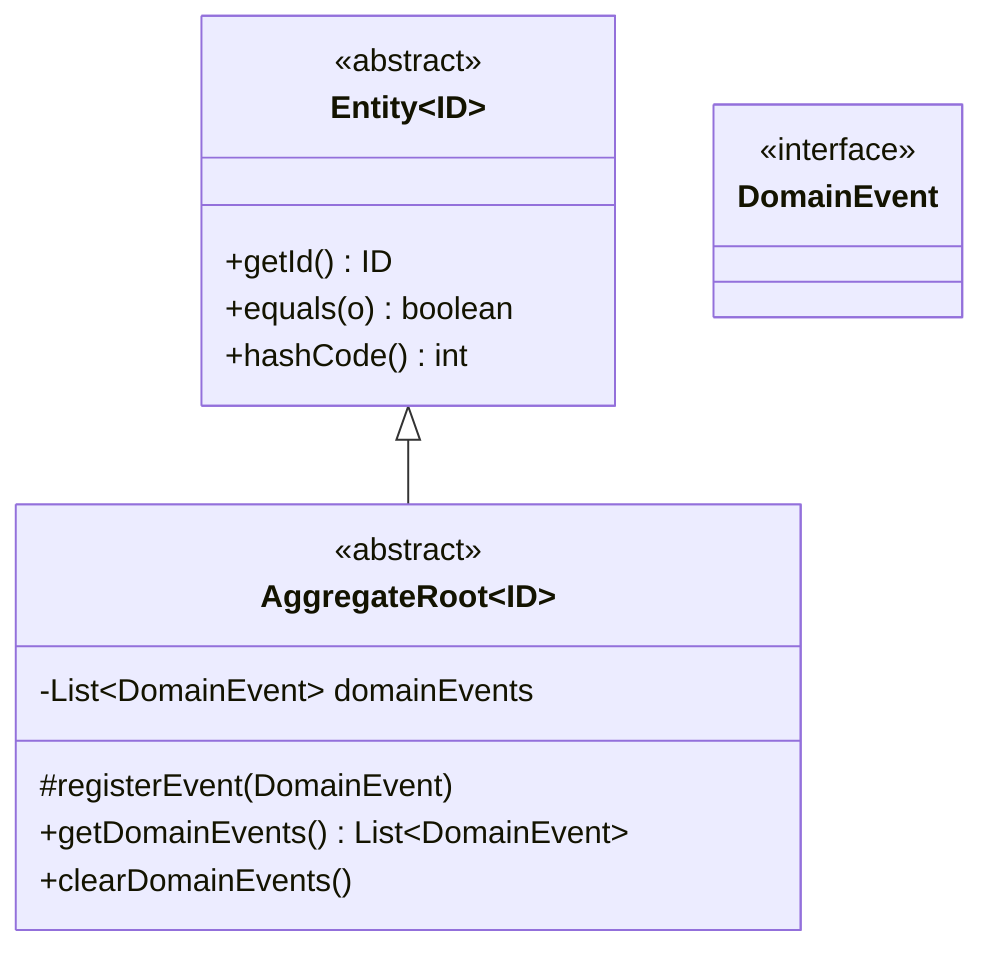
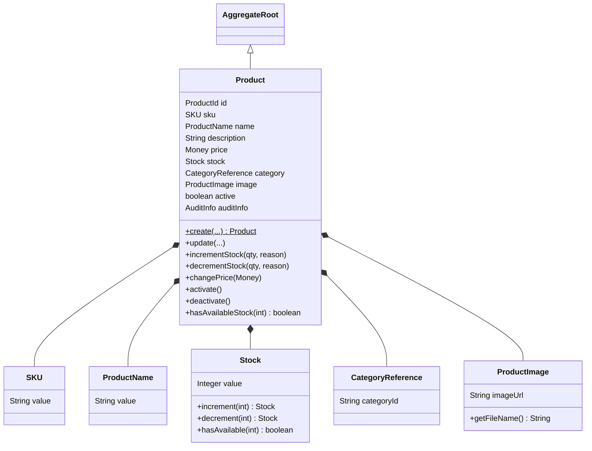
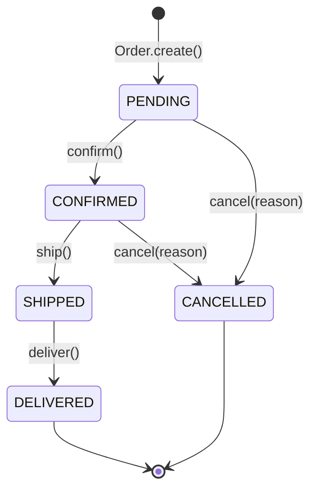

# Modelo de Dominio DDD — ERP Lite

Building blocks tácticos de Domain-Driven Design agregados en `erp-domain` (rama `03-ddd`):
Entities, Value Objects, Aggregate Roots y Domain Events, junto con el puerto de integración
externa `customer` y el demo ejecutable que ilustra todo el flujo sin infraestructura.

> Este documento complementa a [`arquitectura-proyecto.md`](arquitectura-proyecto.md) (módulos
> Maven y persistencia JPA/Mongo) y a [`jpa-entities-lombok.md`](jpa-entities-lombok.md) /
> [`spring-data-mongo-mappings.md`](spring-data-mongo-mappings.md) (mapeo a base de datos).
> Aquí el foco es el **modelo de dominio puro**: clases plain-Java sin anotaciones de
> persistencia, pensadas para expresar reglas de negocio.

---

## Tabla de contenido

1. [Ubicación en el módulo](#1-ubicación-en-el-módulo)
2. [Building blocks base](#2-building-blocks-base)
3. [Value Objects compartidos (`shared`)](#3-value-objects-compartidos-shared)
4. [Aggregate `Product`](#4-aggregate-product)
5. [Aggregate `Order`](#5-aggregate-order)
6. [Puerto `customer` — integración externa](#6-puerto-customer--integración-externa)
7. [Demo ejecutable — `DomainFlowDemo`](#7-demo-ejecutable--domainflowdemo)
8. [Estado de los tests](#8-estado-de-los-tests)

---

## 1. Ubicación en el módulo

```
erp-domain/src/main/java/com/SpringBoot/domain/
├── common/                    building blocks base (Entity, AggregateRoot, DomainEvent)
├── shared/                    Value Objects transversales (Money, Quantity, AuditInfo, CustomerId, Email)
├── product/                   Aggregate Product + sus VOs + events/
├── order/                     Aggregate Order + sus VOs + events/
├── customer/                  Puerto hacia el servicio externo de clientes (JSONPlaceholder)
├── entity/    (JPA)            ── documentado en jpa-entities-lombok.md
├── document/  (Mongo)          ── documentado en spring-data-mongo-mappings.md
└── repository/                interfaces Spring Data (JPA + Mongo)

erp-domain/src/test/java/com/SpringBoot/domain/
└── DomainFlowDemo.java        clase main de demostración (no es un unit test JUnit)
```

`common`, `shared`, `product`, `order` y `customer` no dependen de Spring, JPA ni MongoDB — son
Java puro. Conviven en el mismo módulo que `entity`/`document` (que sí son modelos de
persistencia), pero conceptualmente son dos capas distintas dentro de `erp-domain`.

---

## 2. Building blocks base



- **`Entity<ID>`**: `equals`/`hashCode` basados únicamente en `getId()` — dos entidades son
  iguales si comparten identidad, sin importar el resto de sus campos (regla clásica de DDD,
  evita comparar por valor como se haría con un Value Object).
- **`AggregateRoot<ID>`**: acumula `DomainEvent`s en una lista interna vía `registerEvent()`
  (protegido, solo lo usan las subclases). La capa de aplicación los lee con
  `getDomainEvents()` y los descarta con `clearDomainEvents()` tras publicarlos —
  el propio agregado nunca los publica ni depende de un event bus.
- **`DomainEvent`**: marker interface vacío. Cada evento concreto es un `record` inmutable
  (ver [`StockChanged`](#eventos-de-product) y [`OrderCreated`](#eventos-de-order) más abajo).

---

## 3. Value Objects compartidos (`shared`)

| Value Object | Invariantes | Factory |
|---|---|---|
| `Money(BigDecimal amount, Currency currency)` | `amount >= 0`; `add`/`subtract` exigen misma moneda; `subtract` no permite resultado negativo | `Money.of(double\|BigDecimal, Currency)` |
| `Quantity(Integer value)` | `value > 0` | `Quantity.of(int)` |
| `AuditInfo(String createdBy, Instant createdAt, Instant updatedAt)` | `createdBy` no blank; timestamps no nulos | `AuditInfo.create(createdBy, now)`, `.updateTimestamp()` devuelve una copia con `updatedAt` refrescado |
| `CustomerId(Long value)` | `value > 0` | `CustomerId.of(Long)` |
| `Email(String value)` | regex `^[A-Za-z0-9+_.-]+@[A-Za-z0-9.-]+\.[A-Za-z]{2,}$` | `Email.of(String)` |

Todos son `record` de Java: inmutables por construcción, con el constructor compacto
lanzando `IllegalArgumentException` ante cualquier invariante violada (fail-fast, sin
setters ni estados intermedios inválidos).

```java
Money price = Money.of(1299.99, Currency.getInstance("USD"));
Money total = price.multiply(Quantity.of(3)); // 3899.97 USD, sin mutar `price`
```

---

## 4. Aggregate `Product`



- **`Product.create(...)`** es el único punto de entrada para crear un producto: genera un
  `ProductId` (UUID), fija `active = true`, crea `AuditInfo` y registra `ProductCreated`.
  No existe un constructor público — el `NoArgsConstructor` es `protected` (lo necesita
  Lombok/frameworks, no la capa de aplicación).
- **`Stock`** es inmutable: `incrementStock`/`decrementStock` en `Product` reasignan
  `this.stock = this.stock.increment(n)` en vez de mutar un contador — cada cambio queda
  respaldado por un evento `StockChanged` con el valor anterior y el nuevo.
- **`changePrice`** exige `amount > 0` (no solo `>= 0` como el VO `Money` genérico) —
  la regla "precio de venta positivo" es una invariante del agregado `Product`, no de `Money`.

### Eventos de `Product`

`ProductCreated`, `ProductUpdated`, `StockChanged`, `ProductDeactivated` — todos `record`
en `product.events`, implementan `DomainEvent`, y viajan con snapshot de los datos relevantes
(nunca una referencia mutable al agregado).

```java
public record StockChanged(ProductId productId, Integer oldStock, Integer newStock,
                            String reason, Instant timestamp) implements DomainEvent { ... }
```

---

## 5. Aggregate `Order`



`OrderStatus` (record `value: String`) implementa la máquina de estados vía un mapa estático
`TRANSITIONS`; `Order.validateTransition()` consulta `canTransitionTo()` antes de cada cambio
y lanza `IllegalStateException` si la transición no está permitida (p. ej. `DELIVERED →
CANCELLED`).

- **`OrderItem.from(product, quantity)`**: crea un **snapshot** — congela `productName` y
  `price` del producto en ese instante — para que cambios futuros en `Product` (precio,
  nombre) no alteren órdenes ya creadas.
  > Nota: la implementación actual **no** valida que el producto esté activo ni que tenga
  > stock suficiente en el momento de crear el `OrderItem`; esa validación, si se requiere,
  > debe añadirse explícitamente (ver comentario en `DomainFlowDemo`).
- **`Order.create(...)`** valida que la lista de ítems no esté vacía, calcula `totalAmount`
  sumando subtotales (`Money.add` exige la misma moneda en todos los ítems) y registra
  `OrderCreated`.
- **`addItem`/`removeItem`** no restringen el estado a `PENDING` a nivel de código —
  el comentario original que documentaba esa regla no corresponde a una validación real en
  `Order.java` actual; solo `confirm()/ship()/deliver()/cancel()` están protegidos por la
  máquina de estados.

### Eventos de `Order`

`OrderCreated`, `OrderConfirmed`, `OrderShipped`, `OrderDelivered`, `OrderCancelled` en
`order.events`. `OrderCreated` lleva `CustomerId` + `customerName` + `totalAmount` —
suficiente para que un listener downstream actúe sin volver a consultar el agregado.

```java
public record OrderCreated(OrderId orderId, CustomerId customerId, String customerName,
                            Money totalAmount, Instant timestamp) implements DomainEvent { ... }
```

---

## 6. Puerto `customer` — integración externa

```java
package com.SpringBoot.domain.customer;

public interface CustomerProvider {
    Optional<CustomerInfo> findById(Long id);
    boolean existsById(Long id);
}
```

`CustomerProvider` es un **puerto** (patrón hexagonal): el dominio declara la interfaz,
`erp-infrastructure` deberá aportar la implementación concreta (cliente HTTP hacia
JSONPlaceholder u otro servicio de clientes). `CustomerInfo` es el Value Object de
transporte — inmutable, sin persistencia propia:

```java
public record CustomerInfo(Long id, String name, String email, String phone,
                            String address, String city, String zipcode, String companyName) {
    public CustomerInfo {
        if (id == null) throw new IllegalArgumentException("id is not present");
        if (name == null || name.isBlank()) throw new IllegalArgumentException("name is not present");
    }
}
```

Nótese que `order.Customer` (VO embebido en el agregado `Order`, con `CustomerId` +
`customerName`) y `customer.CustomerInfo` (respuesta completa del proveedor externo) son
tipos distintos y deliberadamente no unificados: `Order` solo necesita un snapshot mínimo,
mientras que `CustomerInfo` expone todos los datos del servicio externo.

---

## 7. Demo ejecutable — `DomainFlowDemo`

`erp-domain/src/test/java/com/SpringBoot/domain/DomainFlowDemo.java` es una clase con
`main()` (no un test JUnit) que recorre el flujo completo sin base de datos ni HTTP:

1. Construye un `Catalog`/`CatalogItem` (documento Mongo, ver sección 2).
2. Crea productos con `Product.create(...)` y sus Value Objects.
3. Ajusta stock (`incrementStock`/`decrementStock`) y observa los `DomainEvent`s generados.
4. Cambia precio y desactiva un producto.
5. Crea una `Order` a partir de `OrderItem.from(...)`, la modifica en `PENDING` y la lleva
   por el ciclo de vida completo (`confirm → ship → deliver`).
6. Demuestra cancelación desde `CONFIRMED`.
7. Prueba invariantes de Value Objects (`SKU`, `Money`, `Stock`, `CustomerId`, `ProductName`,
   `Order` sin ítems, transición inválida de estado) esperando `IllegalArgumentException` /
   `IllegalStateException`.

Se ejecuta desde el IDE (botón "Run" sobre `main`) o con Maven:

```bash
mvn -pl erp-domain -am test-compile exec:java -Dexec.mainClass=com.SpringBoot.domain.DomainFlowDemo -Dexec.classpathScope=test
```

> Vive en `src/test` (no en `src/main`) precisamente para no empaquetarse en el jar de
> producción — es material didáctico, no parte del runtime del ERP.

---

## 8. Estado de los tests

No hay unit tests (JUnit) todavía para el modelo de dominio. Lo único existente en todo el
proyecto es el test de arranque por defecto de Spring Boot:

```java
// erp-api/src/test/java/com/SpringBoot/api/ErpApiApplicationTests.java
@SpringBootTest
class ErpApiApplicationTests {
    @Test
    void contextLoads() {}
}
```

Candidatos naturales para los primeros unit tests (no requieren Spring ni base de datos,
solo JUnit 5 puro):

- `erp-domain/src/test/java/com/SpringBoot/domain/product/ProductTest.java` — invariantes de
  creación, `incrementStock`/`decrementStock`, `changePrice`, `deactivate`.
- `erp-domain/src/test/java/com/SpringBoot/domain/order/OrderTest.java` — máquina de estados
  de `OrderStatus`, cálculo de `totalAmount`, transiciones inválidas.
- `erp-domain/src/test/java/com/SpringBoot/domain/shared/MoneyTest.java`,
  `StockTest.java`, `SKUTest.java` — validación de Value Objects.
